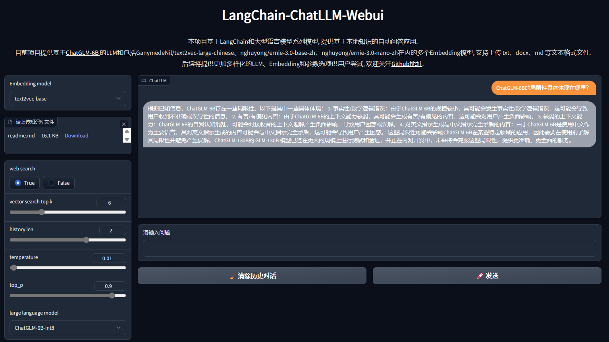

 LangChain-ChatGLM-Webui
 

  
  
  

## 🔥项目体验

本项目提供基于ModelScope魔搭社区的[在线体验](https://modelscope.cn/studios/AI-ModelScope/LangChain-ChatLLM/summary), 欢迎尝试和反馈!

## 👏项目介绍

受[langchain-ChatGLM](https://github.com/imClumsyPanda/langchain-ChatGLM)启发, 利用LangChain和ChatGLM-6B系列模型制作的Webui, 提供基于本地知识的大模型应用.

目前支持上传 txt、docx、md 等文本格式文件, 提供包括[ChatGLM-6B]、[ChatGLM-6B-int4]的模型文件以及[GanymedeNil/text2vec-large-chinese](https://huggingface.co/GanymedeNil/text2vec-large-chinese)、[nghuyong/ernie-3.0-base-zh](https://huggingface.co/nghuyong/ernie-3.0-base-zh)、[nghuyong/ernie-3.0-nano-zh](https://huggingface.co/nghuyong/ernie-3.0-nano-zh)的Embedding模型.

效果如下:

## 🚀使用方式
提供ModelScope版本和HuggingFace版本。其中ModelScope版本下载更稳定、效果更优。  
**需要Python>=3.8.1**

1. git clone本项目: `git clone https://github.com/thomas-yanxin/LangChain-ChatGLM-Webui.git`
2. 进入本项目目录：`cd LangChain-ChatGLM-Webui`
3. 安装依赖包：`pip3 install -r requirements.txt`
4. 执行app.py：`python3 app.py`

## 💪Todo

* [x] 多个模型选择
* [x] 支持上下文
* [ ] 支持上传多个文本文件
* [x] 提供ModelScope版本
* [ ] 支持用户自定义Embedding模型

## ❤️引用

1. [ChatGLM-6B](https://github.com/THUDM/ChatGLM-6B): ChatGLM-6B: 开源双语对话语言模型
2. [LangChain](https://github.com/hwchase17/langchain): Building applications with LLMs through composability
3. [langchain-ChatGLM](https://github.com/imClumsyPanda/langchain-ChatGLM): 基于本地知识的 ChatGLM 应用实现

## 🙇‍感谢

1. [langchain-ChatGLM](https://github.com/imClumsyPanda/langchain-ChatGLM)提供的基础框架
2. [魔搭ModelScope](https://modelscope.cn/home)提供展示空间
3. [OpenI启智社区](https://openi.pcl.ac.cn/)提供调试算力
