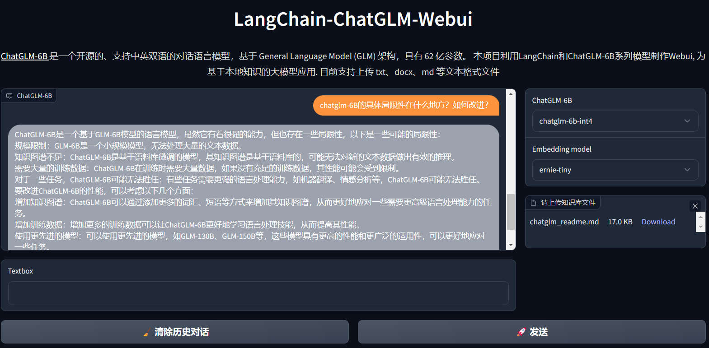

# LangChain-ChatGLM-Webui

## 介绍

利用LangChain和ChatGLM-6B系列模型制作的Webui, 基于本地知识的大模型应用.

目前支持上传 txt、docx、md 等文本格式文件.

## 使用方式

**需要Python>=3.8.1**
1. git clone本项目: `git clone https://github.com/thomas-yanxin/LangChain-ChatGLM-Webui.git`
2. 进入本项目目录：`cd LangChain-ChatGLM-Webui`
3. 安装依赖包：`pip3 install -r requirements.txt`
4. 执行app.py：`python3 app.py`

## Todo

* [x] 多个模型选择
* [ ] 支持上下文
* [ ] 优化模型加载机制及内存使用
* [ ] 支持上传多个文本文件
* [ ] 提供ModelScope版本

## 已知问题

1. 在A100 40GB 机器上部署，速度仍旧**非常**慢。

## 引用

1. [ChatGLM-6B](https://github.com/THUDM/ChatGLM-6B): ChatGLM-6B: 开源双语对话语言模型
2. [LangChain](https://github.com/hwchase17/langchain): Building applications with LLMs through composability
3. [langchain-ChatGLM](https://github.com/imClumsyPanda/langchain-ChatGLM): 基于本地知识的 ChatGLM 应用实现
